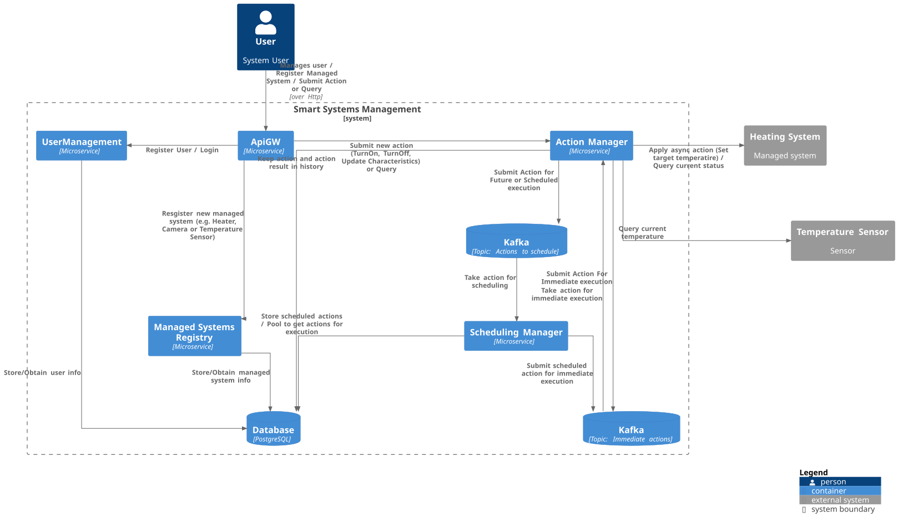
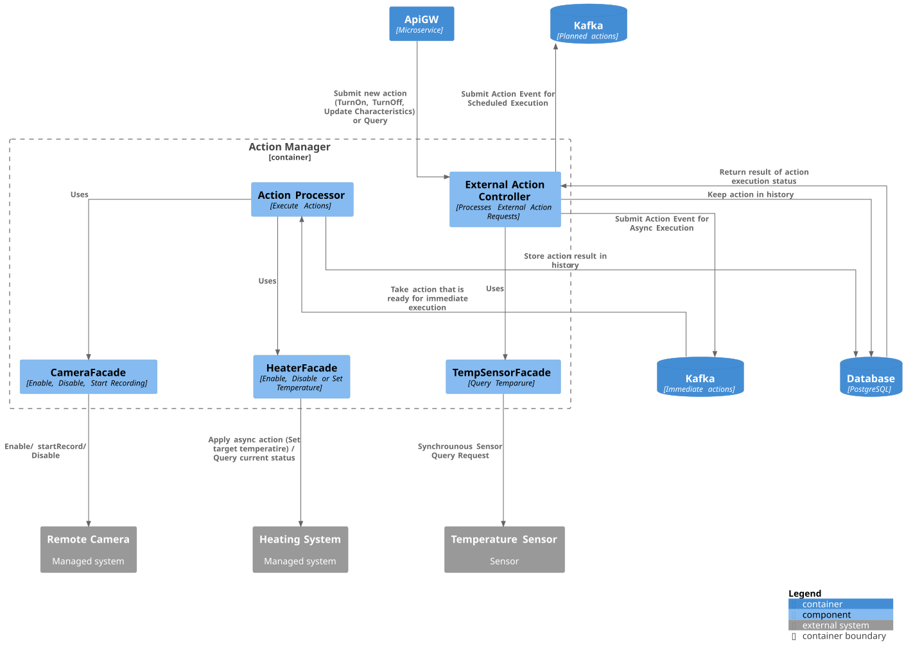
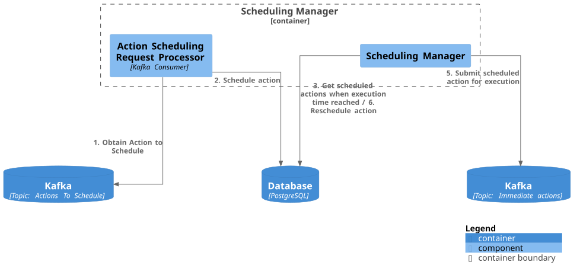
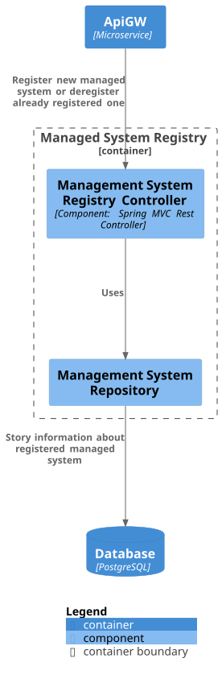
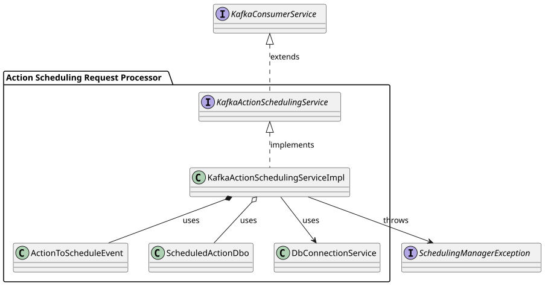
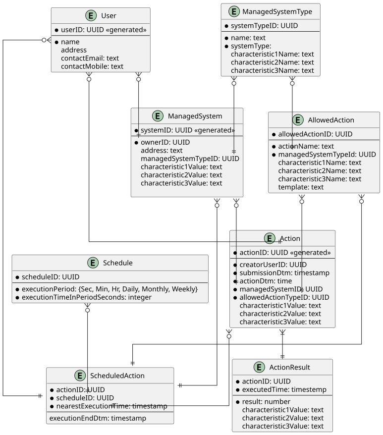

# Project_template

Тип: Материал
Родитель: Описание проекта для 11 когорты (https://www.notion.so/11-03abbbbc8bcb49ed9b85c9b6d1174056?pvs=21)

# ✅ Задание 1. Анализ и планирование

### 1. Описание функциональности монолитного приложения

Приложение компании позволяет управлять отоплением в доме и проверять температуру.
Каждая установка сопровождается выездом специалиста по подключению системы отопления в доме к текущей версии системы. (Предполагается, что специалист добавляет информацию об устройствах напрямую в базу данных минуя функциональность приложения)

**Управление отоплением:**

- Пользователи могут удаленно управлять нагревательным элементом: включать, выключать и устанавливать желаемую температуру, а также запрашивать информацию о состоянии нагревательного элемента.
- Система поддерживает включение и выключение отопителя, установку его температуры (не релизовано) и выдачу информации о текущем состоянии нагревателя. Также запрос на изменение состояния сохраняется в базе данных.

**Мониторинг температуры:**

- Пользователи могут могут просмотривать текущую температуру в своих домах через веб-интерфейс.
- Система получает данные о температуре с датчиков, установленных в домах (не релизовано в приложении).

### 2. Анализ архитектуры монолитного приложения

Язык программирования: Java
База данных: PostgreSQL
Архитектура: Монолитная, все компоненты системы (обработка запросов, бизнес-логика, работа с данными) находятся в рамках одного приложения. Работает в stateless режиме.
Взаимодействие: Синхронное. Количество параллельных запросов ограничено количеством тредов на веб-сервере.
Масштабируемость: Не ограничена, при использовании внешнего http load balancer (например nginx), так как все операции stateless. Ограничена, без внешнего лоад балансера в силу монолитного подхода. 
Развёртывание: Требует остановки всего приложения.

### 3. Определение доменов и границы контекстов

Домен: Управление и контроль за оборудованием по сети
    Поддомен: Управление нагревательным элементом
        Контекст: Установка и контроль желаемой температуры
        Контекст: Контроль текущей температуры в доме

**Основные элементы:**
Entities: HeatingSystem, TemperatureSensor
Repositories: HeatingSystemRepository, TemperatureSensorRepository
Services: HeatingSystemService

### **4. Проблемы решения**

- синхронные запросы требуют хорошего интернета и высокой доступности управляемых/запрашиваемых систем. В противном случае запросы будут подвисать;
- количество паралельных запросов ограничего количеством тредов на сервере. При большом количестве внешних запросов, они будут подвисать ожидая выполнения предыдущих операций или отклоняться.
- текущее решение не включает никакой авторизации (достаточно знать id подключенного оборудования)

- монолитный подход для решения текущей задачи обоснован тем что:
1. Текущий функционал очень простой (один домен) и нет необходимости разбивать на микросервисы 
2. Приложение легко масштабируется (при высокой загрузке) - достаточно лишь настроить внешний балансер http запросов так как:
    1. приложение работает в stateless режиме, где все вызовы идемпотентны и нет необходимости в оркестрации
    2. используются синхронные вызовы
3. команда разработки и поддержки небольшая

### 5. Визуализация контекста системы — диаграмма С4

[C4ContextWarmHouse](C4ContextWarmHouse.puml)

# ✅ Задание 2. Проектирование микросервисной архитектуры

### 1. Описание функциональности приложения

Приложение должно:
- регистрировать новых пользователей и авторизоваться уже существующим
- позволять пользователю регистрировать самому новые устройства, задавая их тип. 
    - Новые типы устройств добавляются командой разработки, с добавлением шаблонов отображения устройства и его свойств
- позволять пользователю управлять зарегистрированными устройствами
    - включать, выключать, задавать желаемые аттрибуты (например: температуру для обогревателя)
    - просматривать состояние устройства (включен, выключен) и его аттрибуты:
        - желаемую температуру обогревателя
        - видеопоток для видеокамеры
        - текущую температуру от этого датчика
    - задавать расписание управления устройствами (выключить внешнее освещение утром, включить обогреватель в 6 вечера)
- логгировать все запросы пользователя в базе
- перепосылать запросы на применение изменений в случае перегрузки системы или временной недоступности устройства (плохой интернет в доме)

**Диаграмма контейнеров (Containers)**

[Диаграмма контейнера системы управления умными устройствами (Smart Systems)](diagrams/C4ContainerDiagram.puml)

**Диаграмма компонентов (Components)**

Детализация добавлена для следующих компонентов:

[1. Action Manager - микросервис выполнения задач](diagrams/C4ActionManagerComponentDiagram.puml)

[2. Scheduling Manager - микросервис управляющий выполнением задач по расписанию](diagrams/C4SchedulingManagerComponentDiagram.puml)

[3. Managed System Registry - микросервис менеджмента упраляюемыми устройствами](diagrams/C4ManagedSystemRegistryComponentDiagram.puml)

**Диаграмма кода (Code)**

[Диаграмма кода для компоненты, обрабатывающей запросы на действия по расписанию](diagrams/C4ManagedSystemRegistryComponentDiagram.puml)

# ✅ Задание 3. Разработка ER-диаграммы

[ER Диаграмма дата модели](diagrams/ERDiagram.puml)

# ❌ Задание 4. Создание и документирование API

### 1. Тип API

Укажите, какой тип API вы будете использовать для взаимодействия микросервисов. Объясните своё решение.

### 2. Документация API

Здесь приложите ссылки на документацию API для микросервисов, которые вы спроектировали в первой части проектной работы. Для документирования используйте Swagger/OpenAPI или AsyncAPI.